# OA News - Next.js News Application

## 📸 Screenshots

### 🏠 Homepage
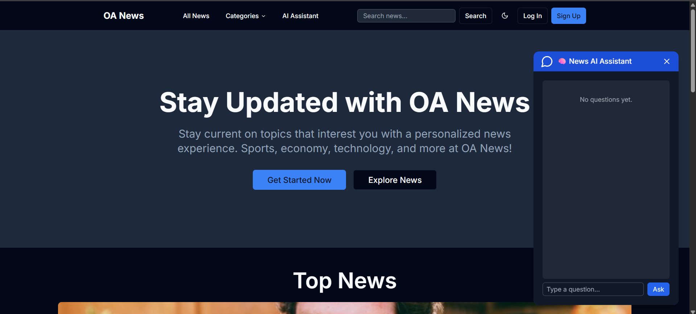

### 🗞️ All News
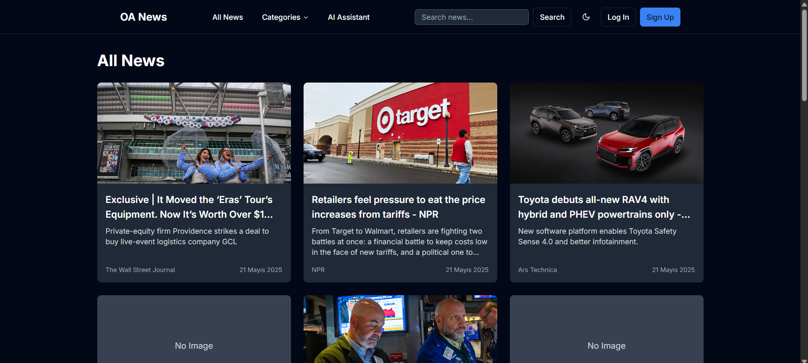

### 🧠 AI Assistant
AI Assistant searches on Google and answers your questions.
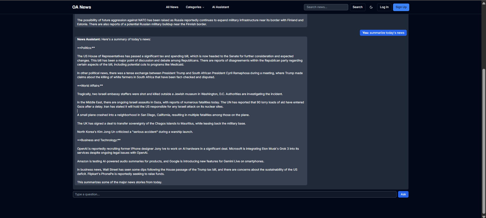

### 💬 AI Assistant 2
Ask news-related questions and get instant AI responses.
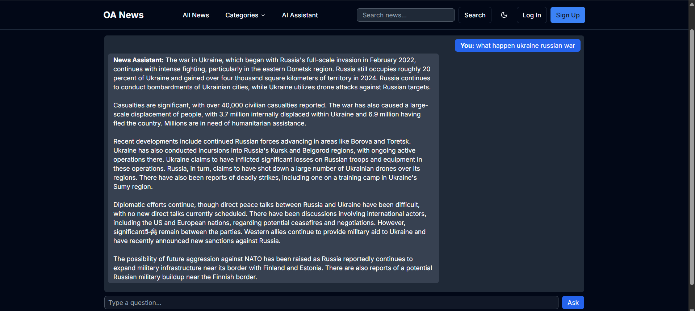

### 📂 Categorized News
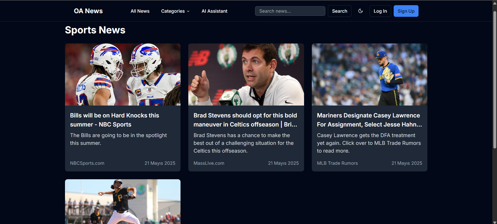
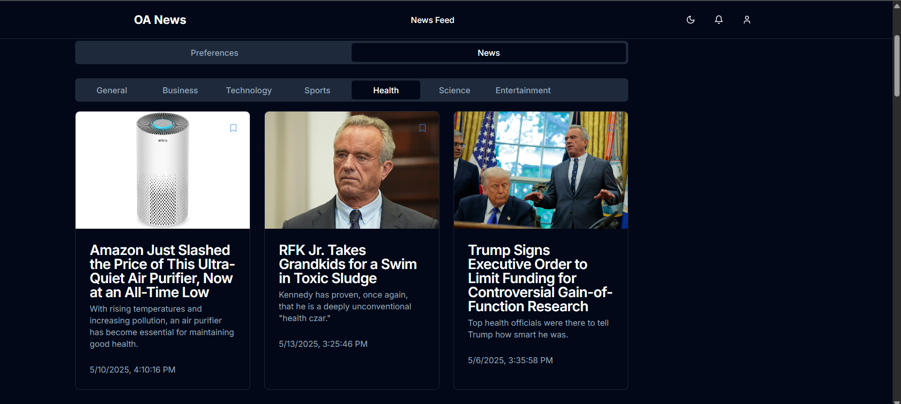

### ⭐ Favorites
Save news articles to your favorites to read later.
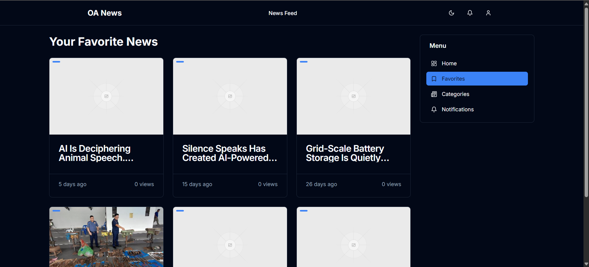

### 🔔 Notifications
Enable news notifications by category.
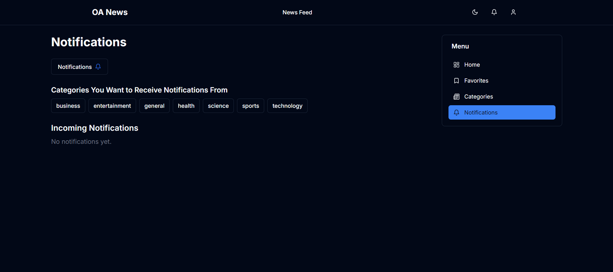

### 🔝 Top News
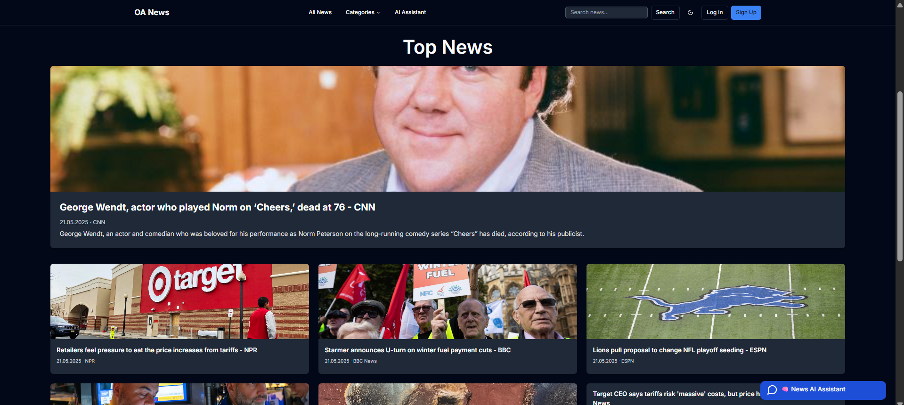

### 🧑‍💼 Your News Preferences
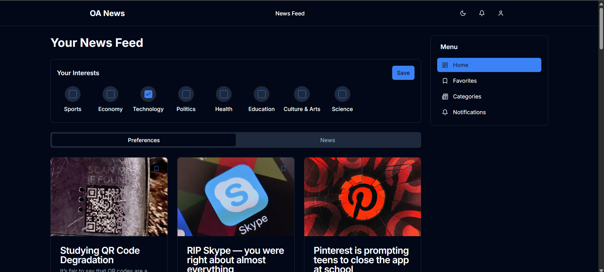

### 📝 Sign Up / Login
Supports Google authentication.
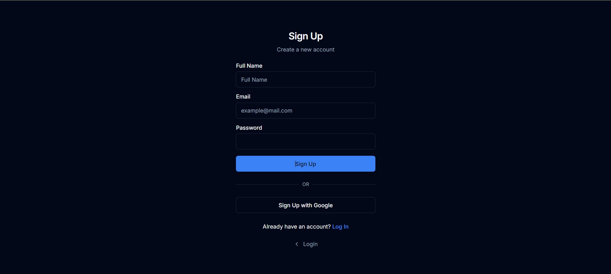

### ⚙️ Account Settings
Update username, profile photo, bio, password, and email.
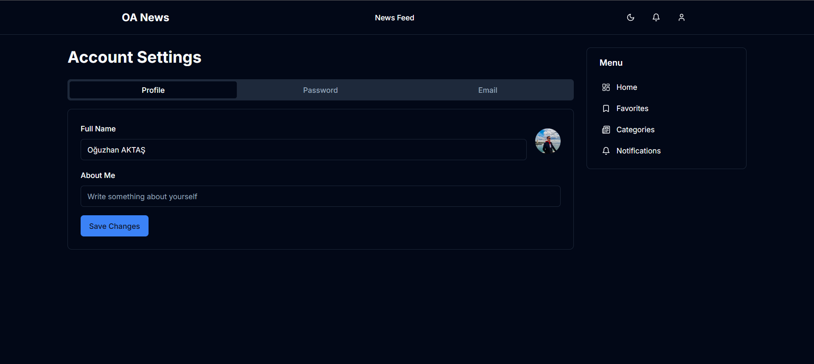


## About the Project

OA News is a modern news application built with React.  
The backend and frontend are fully integrated using Next.js.  
News data is fetched from two different sources: NewsAPI and GNews API.  
Additionally, AI-powered news recommendations are provided using the Gemini AI model.

---

### Key Features

- **User Registration and Login:** Secure signup, login, password change, email change, and password reset using Firebase Authentication.
- **User Preferences:** User preferences and favorite news are saved in Firebase Realtime Database.
- **News Categories:** News is categorized by Technology, Sports, Economy, and more.
- **Search:** Keyword-based news search functionality.
- **Trending News:** Displays current popular news on the homepage.
- **Favorites:** Users can add desired news articles to their favorites.
- **Notifications:** Users receive notifications about new news based on selected categories.
- **Theme Support:** Switch between dark and light mode.

---

## Technologies Used

- Next.js (React + Node.js)
- Firebase Authentication and Realtime Database
- NewsAPI & GNews API
- Gemini AI Model Integration
- Tailwind CSS
- TypeScript

---

## Running the Project Locally

1. Clone this repository:

   ```bash
   git clone https://github.com/oguzhanaktas1/your-repo-name.git
   cd your-repo-name


---

## Setting Up API Keys and Environment Variables

To run this project locally, you need to obtain API keys and credentials from Firebase and Gemini AI. Then add them to your `.env.local` file.

### 1. Firebase Setup

1. Go to [Firebase Console](https://console.firebase.google.com/).
2. Sign up or log in with your Google account.
3. Click **Add project** and follow the steps to create a new Firebase project.
4. Once your project is created, go to **Project settings** (the gear icon on the sidebar).
5. Scroll down to **Your apps** and click **Add app** (choose **Web**).
6. Register your app (e.g., name it "OA News") and Firebase will provide your Firebase config object.
7. Copy the config keys (`apiKey`, `authDomain`, `projectId`, etc.).
8. Go to **Authentication** in the sidebar and enable **Email/Password** sign-in method.
9. Optionally, enable **Realtime Database** or **Firestore** if used in the project.
10. Create a `.env.local` file in your project root and add the Firebase config like this:

    ```env
    NEXT_PUBLIC_FIREBASE_API_KEY=your_firebase_apiKey
    NEXT_PUBLIC_FIREBASE_AUTH_DOMAIN=your_firebase_authDomain
    NEXT_PUBLIC_FIREBASE_PROJECT_ID=your_firebase_projectId
    NEXT_PUBLIC_FIREBASE_STORAGE_BUCKET=your_firebase_storageBucket
    NEXT_PUBLIC_FIREBASE_MESSAGING_SENDER_ID=your_firebase_messagingSenderId
    NEXT_PUBLIC_FIREBASE_APP_ID=your_firebase_appId
    ```

### 2. Gemini AI API Key Setup

1. Visit the Gemini AI API provider’s website [Gemini AI](https://aistudio.google.com)
2. Sign up for an account or log in.
3. Navigate to the **API Keys** or **Developer** section.
4. Create a new API key for your application.
5. Copy your Gemini AI API key.
6. Add this key to your `.env.local` file:

    ```env
    NEXT_PUBLIC_GEMINI_API_KEY=your_gemini_api_key
    ```

---

### Final `.env.local` Example

```env
NEXT_PUBLIC_FIREBASE_API_KEY=your_firebase_apiKey
NEXT_PUBLIC_FIREBASE_AUTH_DOMAIN=your_firebase_authDomain
NEXT_PUBLIC_FIREBASE_PROJECT_ID=your_firebase_projectId
NEXT_PUBLIC_FIREBASE_STORAGE_BUCKET=your_firebase_storageBucket
NEXT_PUBLIC_FIREBASE_MESSAGING_SENDER_ID=your_firebase_messagingSenderId
NEXT_PUBLIC_FIREBASE_APP_ID=your_firebase_appId

NEXT_PUBLIC_GEMINI_API_KEY=your_gemini_api_key
